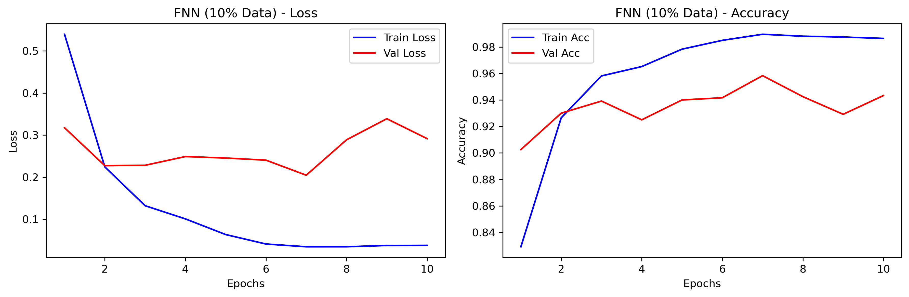
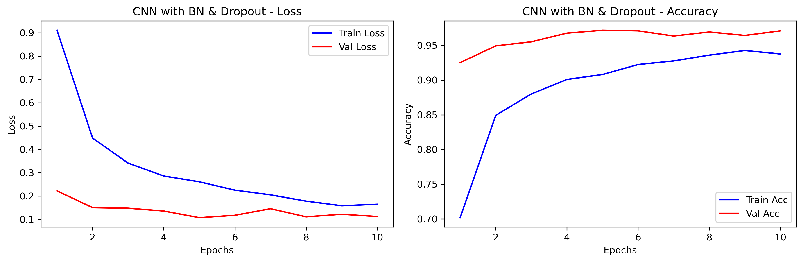

# 
深度学习基础实验 2

### 
PB23111684

### 
黄泽辉

---

## 1. 实验设置

### 1.1 数据集处理

- **数据集**：MNIST 手写数字数据集，包含 60,000 张训练图像和 10,000 张测试图像
- **图像参数**：每张图像为 $28 \times 28$ 像素的灰度图，标签为 0-9 共 10 个类别
- **预处理**：利用 `torchvision.transforms` 将图像转换为 Tensor 并进行标准化（均值 0.1307，标准差 0.3081）
- **数据划分**：
  - **验证机制**：将训练集进一步划分为训练集和验证集，验证集用于保存性能最好的模型
  - **采样比例**：实验主要基于 10% 的随机采样数据，并在分析数据规模影响时增加至 50%

### 1.2 模型架构

实验涉及以下三个主要模型：

1. **BaseCNN**：包含两层卷积（`conv1` 输出 32 维，$3 \times 3$；`conv2` 输出 64 维，$3 \times 3$）、一个 `MaxPool2d` 池化层以及两个全连接层
2. **FNN**：三层全连接神经网络（输入 784 $\rightarrow$ 输出 256 $\rightarrow$ 128 $\rightarrow$ 10）
3. **BatchNormCNN**：在 `BaseCNN` 基础上，在每个卷积层后加入了 `BatchNorm2d` 层、一层 `Dropout` (0.5) ，用于加速收敛和稳定训练

### 1.3 训练配置

- **优化器**：Adam 算法，学习率设为 0.001
- **损失函数**：交叉熵损失（`CrossEntropyLoss`）
- **训练轮数**：10 Epochs
- **批大小**：16

### 1.4 模型训练结果分析（使用10%数据规模）

观察训练和验证过程的损失和准确率图像可知，CNN在训练过程中出现了过拟合的现象（在epochs=4到epochs=5的这一过程中）

实验结果汇总：

---

## 2. 实验分析与对比

本实验选择了实验要求中的三项进行深入分析：**（3）Dropout 与 Normalization**、**（4）模型结构对比** 以及 **（5）数据规模影响**。

### 2.1 模型结构对比：CNN vs FNN

在相同的 10% 数据规模和训练配置下进行对比：

在相同数据与训练配置下，对比FNN，使用CNN可以得到更高的准确率和更低的损失率，分类能力更强。且相比于CNN，FNN的过拟合情况更为严重，泛化能力更弱

### 2.2 Dropout 与 Normalization 的影响

对比 `BaseCNN` 与 `BatchNormCNN`：

- **Batch Normalization**：通过对每一层特征进行规范化，解决了深层网络中的内部协变量偏移问题，使得训练过程更加稳定
- **Dropout**： `BatchNormCNN` 中使用了 0.5 的丢弃率，缓解了小样本下的过拟合，使模型的泛化能力更强

### 2.3 数据规模的影响

对比 10% 与 50% 数据规模对 `BaseCNN` 的影响：

相比于10%训练规模，50%训练规模训练的模型在第一个Epoch的初始Val Acc就已经逼近0.98，收敛速度更快，且整体Val Los的绝对值远低于10%数据量时的表现，训练过程的过拟合情况也较好，模型的性能要更好，泛化能力、分类能力更强

---

## 3. 实验结论

1. **卷积结构的优越性**：针对图像分类任务，CNN 通过参数共享和池化操作，在性能上显著优于全连接网络（FNN）
2. **正则化手段的必要性**：Dropout 和 BN 的引入极大地提高了模型在有限数据集上的健壮性，是防止过拟合的关键，能够极好的提升模型的泛化能力和分类能力
3. **数据量决定上限**：增加数据规模（从 10% 到 50%）是提升模型泛化能力最直接、最有效的方式，在使用更多数据量时，模型往往能得到更好的训练效果，不过更大的训练效果意味着更长的训练时间和要求更高的设备性能。且通过对比增加数据量的方式和通过增加Dropout和BN的方式优化模型，可以发现增加数据量能够更加有效的提高模型在测试集上的准确率

